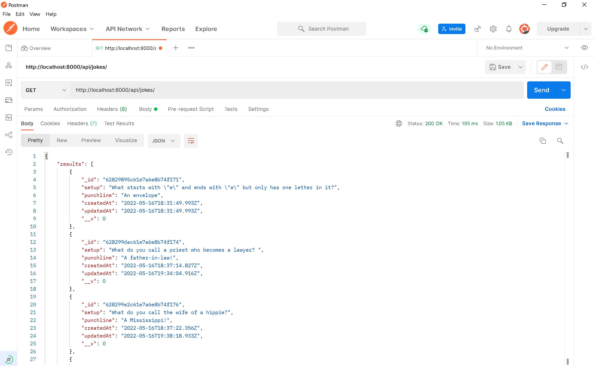
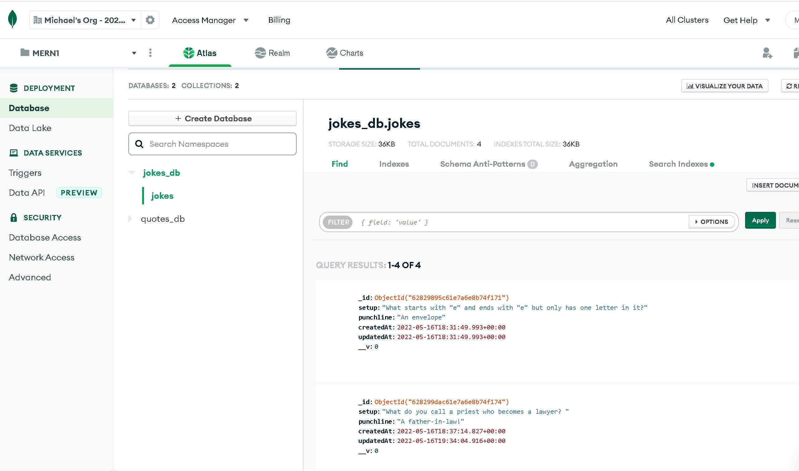

# The Jokes API 

# The project is completed by the following languages and tools.
#### Languages: JavaScript and TypeScript
#### Tools: Postman - a tool that allows us to restful interfact with API's
#### Framework: Express.js - acts as an interface to Node's serer functionality
#### Database and library: MongoDB and Mongoose

### Utitlize PostMan to create, update, read and delete contents (jokes)

###Store our contents (jokes) in MongoDB

